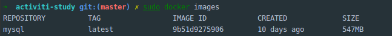

# docker 安装 mysql

### 使用国内镜像

编辑 deamon.json

```bash
vi /etc/docker/daemon.json
```
内容:

```json
{
  "registry-mirrors" : [
    "http://ovfftd6p.mirror.aliyuncs.com",
    "http://registry.docker-cn.com",
    "http://docker.mirrors.ustc.edu.cn",
    "http://hub-mirror.c.163.com"
  ],
  "insecure-registries" : [
    "registry.docker-cn.com",
    "docker.mirrors.ustc.edu.cn"
  ],
  "debug" : true,
  "experimental" : true
}
```

重启 docker 服务
```
systemctl restart docker.service
```

### 安装mysql最新版本镜像

```bash
docker pull mysql:latest
```

### 查看镜像列表

```bash
docker images
```



### 运行容器

创建文件夹

```bash
mkdir -p /mysql/config /mysql/data
```

创建配置文件

```bash
vi /mysql/config/my.conf
```

内容

```properties
[mysqld]
user=mysql
character-set-server=utf8
default_authentication_plugin=mysql_native_password

[client]
default-character-set=utf8

[mysql]
default-character-set=utf8
```

```bash'
docker run -d -p 3306:3306 --restart always --privileged=true --name activiti_mysql -e MYSQL_ROOT_PASSWORD=123456 -v /mysql/config/my.conf:/etc/my.cof -v=/mysql/data:/var/lib/mysql mysql
```

参数说明:

> -d 	后台运行容器

> -p 3306:3306 	指定端口映射(主机(宿主)端口:容器端口)

> --restart=always 	开机启动

> --privileged=true 	提升容器内权限

> --name 	为容器指定一个名称

> -e  	设置环境变量

> MYSQL_ROOT_PASSWORD=123456 	初始密码

> -v /mysql/config/my.conf:/etc/my.cof 映射配置文件

> -v=/mysql/data:/var/lib/mysql 映射数据目录

> mysql 	镜像名称

## 注意

链接时jdbc url请补全参数

```text
jdbc:mysql://localhost:3306?useUnicode=true&characterEncoding=UTF-8&useJDBCCompliantTimezoneShift=true&useLegacyDatetimeCode=false&serverTimezone=UTC
```

## docker 其他重要命令

- 拉取一个镜像

> docker pull 

- 查看镜像列表

> docker images

- 删除一个镜像

> docker rmi

- 创建一个实例

> docker run

- 开启一个实例

> docker start

-  关闭一个实例

> docker stop

- 删除一个实例

> docker rm

- 进入一个实例

> docker attach
